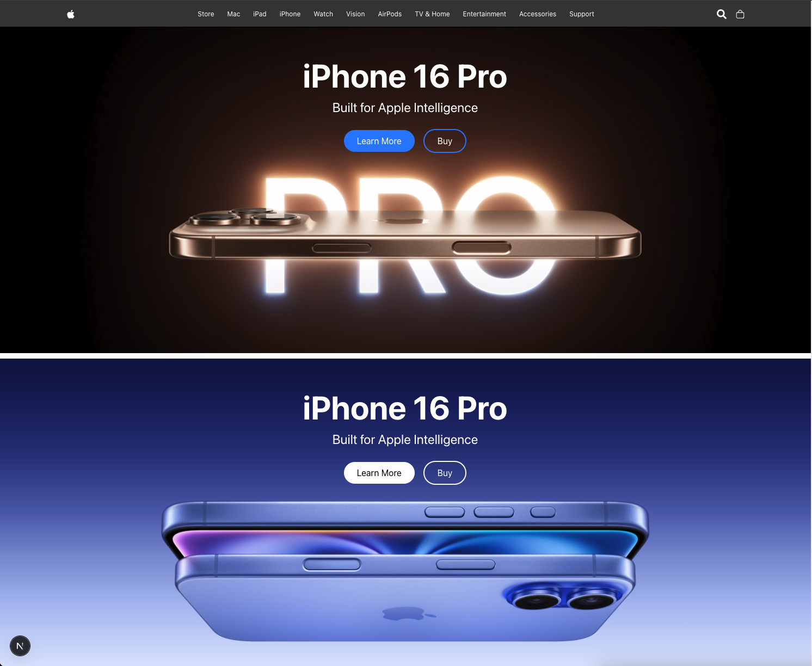

# 🍏 Apple Mock Frontend — Next.js + TypeScript + Tailwind CSS

Welcome to my Apple-inspired mock frontend!  
This project is a pixel-perfect implementation of an Apple-style landing page, built to demonstrate my ability to translate UI designs into clean, maintainable code.

## 🚀 Project Purpose

The goal of this project is to showcase my front-end development skills — specifically:
- **Translating high-fidelity UI designs into code**
- **Building responsive layouts**
- **Writing clean, scalable TypeScript components**
- **Utilizing modern tools like Next.js and Tailwind CSS for rapid development**

This mock frontend mirrors the sleek, minimal aesthetic of Apple's design language, focusing on visual precision, smooth responsiveness, and developer-friendly code architecture.

## 🛠️ Tech Stack

- **Next.js** — React framework for building fast and scalable web applications
- **TypeScript** — For type safety and better developer experience
- **Tailwind CSS** — Utility-first CSS framework for rapidly building custom UIs

## 🎨 Features

- Fully responsive layout (mobile, tablet, desktop)
- Clean, semantic HTML structure
- Reusable, modular components
- Smooth transitions and hover effects
- Fast load times & optimized performance
- Pixel-perfect attention to detail

## 🧩 How I Built It

1. **Planning & Setup**
   - Chose Next.js for its performance and developer experience.
   - Integrated TypeScript for static typing.
   - Set up Tailwind CSS for fast, consistent styling.

2. **Breaking Down the Design**
   - Analyzed the UI design and identified reusable components (e.g., navbar, hero section, product highlights).
   - Built a component-driven architecture to keep code clean and maintainable.

3. **Building the Layout**
   - Used Tailwind’s grid and flex utilities to structure responsive layouts.
   - Applied consistent spacing, typography, and color palettes inspired by Apple's design guidelines.

4. **Polishing**
   - Added subtle animations and hover states for interactivity.
   - Focused on accessibility and semantic HTML.

5. **Testing & Optimization**
   - Tested across devices and screen sizes.
   - Optimized images and code for performance.

## 📸 Screenshot




## 📦 Installation

If you’d like to run the project locally:

```bash
git clone https://github.com/Zachary-Wood/Apple-front-end-clone
cd my-app
npm install
npm run dev

